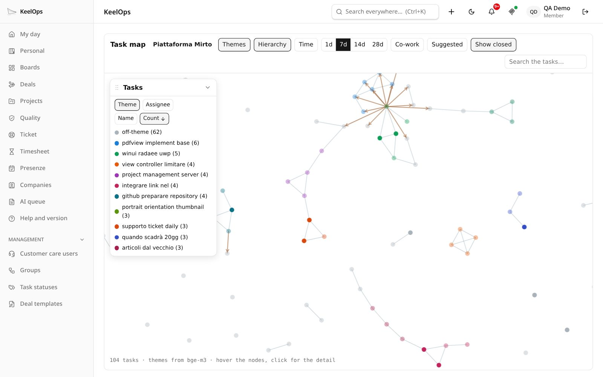

# Pages in the application

A plugin's pages are ordinary HTML served by its routes or its static
folder. The application shows them in a **same-origin frame**: in the main
area when the person opens the plugin from the menu, inside a core page when
the plugin is anchored there, under a button of the top bar. Same origin
means the session cookie, the theme and the language all arrive by
themselves.



*The task map (TasksMap) is a plugin that lives inside a core page: it has
no menu entry, it is opened from the ⋯ menu of a project, and it draws the
project's tasks as a graph — themes read from the text by the local models,
hierarchy, time windows, who worked with whom.*

## Where a page shows up

| how | manifest | what the person sees |
|---|---|---|
| **Menu entry** | `ui.voce`, `ui.icona`, `ui.menu: true` | an entry in the side menu; the page fills the main area at `/estensioni/<name>` |
| **Anchor** | `anchors: { project: true }` … | a command inside a core page (a menu item, a button) that opens the plugin with a reference in the query string |
| **Panel** | `anchors: { dashboard: true }`, `task`, … | the plugin's page inside a core page, framed, sized to its content |
| **Bar button** | `ui.barra` | a button between the bell and the profile, with a state dot and a small panel |

The query string of `/estensioni/<name>?…` is passed to the plugin's page as
it is, so an anchor that opens `?progetto=<id>` lets the page read
`new URLSearchParams(location.search).get("progetto")`.

## Anchors

An anchor declares **which part of the application the plugin is a child
of**. The core draws the command only where a plugin with that anchor
exists: with no plugin, the interface says nothing about plugins.

| anchor | command | opens the plugin with |
|---|---|---|
| `project` | ⋯ menu of a project | `?progetto=<projectId>` |
| `profile` | profile menu | — |
| `deal` | a button among a deal's attachments (for who can edit it) | `?offerta=<dealId>` |
| `docx` | a button on a `.docx` attachment (for who can edit the task) | `?allegato=<attachmentId>&task=<taskId>` |
| `task` | a panel inside the task detail | `?task=<taskId>` |
| `dashboard` | a tile on the dashboard | `?ancora=dashboard` |
| `dashboardGroups` | a pill in the dashboard groups | `?ancora=dashboardGroups&gruppo=<key>` |

The anchor says **where** the page opens, not **what** the person may do
there: the page checks permissions with the core (`ctx.tasks.read`,
`ctx.perimeter.canEditTask`) before offering a command.

### Panels

A page shown inside a core page (`?ancora=…` in the query) should:

- drop its own header — the core page already has one;
- load `sdk/riquadro.js`, which tells the host how tall the page is after
  every layout change, so the frame follows the content;
- say when it has **nothing to show**, so the host hides the frame instead of
  leaving an empty box:

```js
window.parent.postMessage({ tipo: "keelops:vuoto", vuoto: true }, location.origin);
// and { tipo: "keelops:vuoto", vuoto: false } to be shown again
```

The dashboard groups (Overdue, Today, Tomorrow, Next days, No deadline) have
a third pill besides *Mine* and *Supervised* when a plugin declares
`dashboardGroups`: the plugin answers `GET api/gruppi` with the counts —
`{ gruppi: { overdue, today, tomorrow, next, none } }` — and the pill opens
its page with `?ancora=dashboardGroups&gruppo=<key>`.

## The bar button

```json
"ui": { "barra": { "icona": "mcp-icona.svg", "stato": "api/barra", "pannello": "barra" } }
```

A button in the top bar, between the notifications bell and the profile.
The core draws it; the plugin says what it means:

- **`icona`**: a monochrome file in the static folder, or an icon name;
- **`stato`**: a route answering `GET` with

  ```json
  { "tono": "acceso", "lampeggia": true, "titolo": "MCP · pseudonymisation on · Claude just read something" }
  ```

  `tono` (tone) colours the dot — `acceso` green, `spento` grey, `bloccato`
  amber, `nessuno` no dot; `lampeggia` (blink) makes it pulse; `titolo` is
  the tooltip, **already translated** in the person's language;
- **`pannello`**: a page of the plugin, opened in a small frame under the
  button (load `sdk/riquadro.js` in it).

The core reads the state every minute, when the panel closes, and **at once**
when the plugin signals it with `ctx.segnali.invia(userId)` — see
[signals](07-core-doors.md#signals). The MCP connector pro uses it to show
whether pseudonymisation is on and to blink while an assistant is reading.

## The look

`BASE_CSS` from `ui.mjs` gives a page the application's colours, font and
radius. It imports `/api/tema.css`, which the core generates **already
resolved for the person looking**: light, dark, or following the system.
Serve it from a route, or interpolate it in a server-rendered page:

```js
["GET", /^\/base\.css$/, (req, res) => {
  res.writeHead(200, { "content-type": "text/css; charset=utf-8" });
  res.end(BASE_CSS);
}],
```

The variables to use in your own CSS:

| variable | what |
|---|---|
| `--carta` | page background |
| `--inchiostro` | text |
| `--tenue` | secondary text |
| `--filo` | borders |
| `--rilievo` | cards, raised surfaces |
| `--accento`, `--accento-fondo` | the accent colour and its soft background |
| `--pericolo` | destructive actions, errors |
| `--raggio` | corner radius |
| `--font` | the system font stack, 15px |

`CARD_CSS` adds a centred single card (consent pages, notices). `ICONS` holds
a few of the application's glyphs as inline SVG.

### Theme

Load `sdk/tema.js` (the core serves it for every plugin). It watches the
application around the frame and mirrors its theme on
`<html data-tema="light|dark">`, **live** — the person flips the switch in the
bar and the plugin changes with everything else. Colours of your own go under
`[data-tema="dark"]`, never under `prefers-color-scheme`: that is the
operating system's choice, not the person's.

## Translations

KeelOps speaks Italian, English, French, German and Spanish, and so should a
plugin page. The SDK has one mechanism, served as `sdk/traduzioni.js`:
**Italian is the key**, the language is the one chosen in KeelOps, a missing
phrase falls back to English and then Italian, `{name}` is replaced.

```html
<script src="sdk/traduzioni.js"></script>
<script src="i18n.js"></script>
<h1 data-i18n="Le mie note"></h1>
<input data-i18n-placeholder="Cerca una nota…">
<button data-i18n-title="Aggiorna">↻</button>
```

```js
// ui/i18n.js — the plugin brings only its catalogues
window.KeelOpsI18n.crea({
  en: { "Le mie note": "My notes", "Cerca una nota…": "Search a note…", "Aggiorna": "Refresh", "{n} note": "{n} notes" },
  fr: { "Le mie note": "Mes notes", "Cerca una nota…": "Chercher une note…", "Aggiorna": "Actualiser", "{n} note": "{n} notes" },
  de: { … },
  es: { … },
}, { titolo: "Le mie note" });
```

```js
// ui/app.js — set the person's language, then translate in code
const me = await (await fetch("api/me")).json();   // your route: { locale: user.locale }
window.i18n.imposta(me.locale);                    // "imposta" = set
list.textContent = t("{n} note", { n: notes.length });
```

- `data-i18n`, `data-i18n-placeholder` and `data-i18n-title` (which also sets
  `aria-label`) translate static labels on their own.
- `t(key, values)` translates in code.
- A page built with a bundler (React, Vite) keeps its own small `i18n.ts` with
  the same rules: it does not load extra scripts.
- **Keep the four catalogues complete.** A test in the core reads every
  plugin's pages, collects the phrases passed to `t()` and `data-i18n*`, and
  fails on one missing in any language.

## The Content Security Policy

Production serves every page with `script-src 'self'`. An **inline script is
not executed** — silently, and only in production (development runs without
the policy, so it looks like it works). Put code in files; the SDK scripts are
files the core serves for you (`sdk/tema.js`, `sdk/riquadro.js`,
`sdk/traduzioni.js`). Forms may only post to the same origin: to send the
browser elsewhere (an OAuth consent), use a link, not a form.
