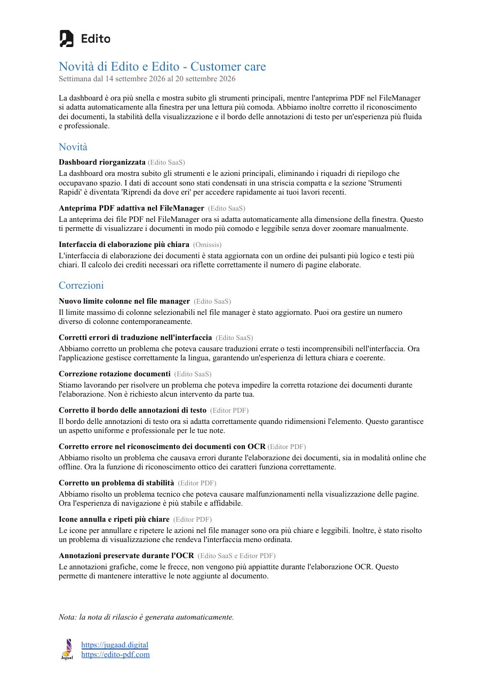

# Local AI: reports and release notes

KeelOps knows what was done, by whom, for which customer, in which week —
because the work lives in it: tasks closed, hours logged, tickets answered,
deals moved. A language model running **on your own server** can turn that
into documents people actually read: the release note for your users, the
monthly report for the administration, the week's summary for the sales
meeting. Nothing leaves the building: the model is an [Ollama](https://ollama.com)
instance on your network, and the SDK talks to it through `ollama.mjs`.

## What KeelOps already does with it

These features are part of KeelOps itself. They are the pattern a plugin
follows, and the proof that it works on real data.

- **Release notes of a project.** From the project page, pick the status
  (*released*, say) and the week: out comes a Word document, by email, with
  an opening paragraph that separates new features, fixes and internal work,
  and one entry per task, written for the person who uses the product — not
  for the developer who closed the task.
- **The newsletter for users.** The same material, week by week, across the
  projects of a product, in the Report view of the timesheet. The example
  below went to the users of a real product.
- **The task map** (a plugin, TasksMap): the themes of a project's tasks,
  read from their text with embeddings, drawn as a graph — see
  [Pages](05-pages.md).
- **Estimates from similar work**: when a task is opened, the tasks that most
  resemble it, and how many hours those took.



*A weekly newsletter produced by KeelOps from the work closed in the week
(Italian, as it went out): an opening paragraph, then **Novità** (new
features) and **Correzioni** (fixes), each entry with the product it belongs
to, and the note that it was generated automatically.*

## What a plugin can build

The same pattern serves anyone who has to **account for work**:

| for | the document | from |
|---|---|---|
| users of a product | the weekly or monthly release note | tasks entered in a *released* status in the period |
| the administration | the month of a customer: requests opened, work done, hours per activity, in plain words | `TimeEntry`, `Task` (`kind = 'TICKET'` and project work) for a `Company` |
| sales | the week's pipeline: what moved, what is stuck, what is worth a call | `Task` with `kind = 'DEAL'`, their stages and values |
| the quality team | the month's non-conformities and the actions that closed them | the plugin's own tables, plus the core tasks they point to |
| the team | the retrospective of a project over a window of time | tasks opened and closed, messages, documents |

The model **writes the prose**. It does not decide what goes in, and it does
not decide the numbers.

## The pattern

1. **Gather with SQL**, deterministically: which tasks, which hours, which
   customer. The model never chooses the material.
2. **Group with rules**, deterministically: which section an entry belongs to
   is decided by its status or its type, not by the model. A cancelled task
   among "what we delivered" would be a lie in a document that goes to a
   customer.
3. **Ask the model only for sentences**, one entry at a time, with a JSON
   schema for the answer.
4. **Write the document** with the numbers from step 1 and the sentences
   from step 3.
5. **Without a model, the document still comes out** — with the task titles
   in place of the sentences — and says so.

### Talking to the model

```js
import { chat } from "…/keelops-sdk/ollama.mjs";

const SCHEMA = {
  type: "object",
  properties: {
    title: { type: "string" },
    text:  { type: "string" },
    kind:  { type: "string", enum: ["feature", "fix", "internal"] },
  },
  required: ["title", "text", "kind"],
};

async function entryFor(task, model) {
  const answer = await chat({
    url: ctx.ollamaUrl,
    model,                                   // a setting of the plugin, e.g. "qwen3:14b"
    system: "You write release notes for the users of a software product. " +
            "One short title and one or two sentences, for someone who uses the product, " +
            "not for the developer. Say only what the task says. Answer in Italian.",
    user: `Task: ${task.title}\n\n${stripHtml(task.description).slice(0, 2000)}`,
    schema: SCHEMA,
    numPredict: 300,
  });
  if (!answer) return { title: task.title, text: "", kind: guessKind(task) };   // no model: still a document
  try { return JSON.parse(answer); } catch { return { title: task.title, text: "", kind: guessKind(task) }; }
}
```

`chat()` returns the model's text, or **`null`** on any failure — server off,
model missing, timeout. It never throws: a plugin always has a plan B, and a
local model must never take a request down with it.

### Gathering the material

```js
// Tasks of a project that ENTERED a released status in the week. The moment of
// a status change lives in the activity log (action "status_changed", payload
// {"from": "<status name>", "to": "<status name>"}), not in the task.
const changes = await ctx.db.all(
  `SELECT a.taskId, a.payload, t.title, t.description
     FROM ActivityLog a
     JOIN Task t ON t.id = a.taskId
    WHERE a.action = 'status_changed'
      AND a.createdAt >= ? AND a.createdAt < ?
      AND t.projectId = ? AND t.deletedAt IS NULL
    ORDER BY a.createdAt`,
  weekStart, weekEnd, projectId,
);
const released = new Map();
for (const c of changes) {
  const to = JSON.parse(c.payload ?? "{}").to;
  if (to === "Rilasciato") released.set(c.taskId, c);   // the name of your released status
}
```

### Writing the document

Build it in whatever the reader expects: HTML for a page, Markdown for an
email, a real `.docx` with the MIT-licensed [`docx`](https://www.npmjs.com/package/docx)
package. Attach it where the work is, with the core's rules:

```js
await ctx.attachments.write(user.id, projectTaskId, {
  name: `release-note-${week}.docx`,
  mimeType: "application/vnd.openxmlformats-officedocument.wordprocessingml.document",
  bytes: buffer,
  ref: `release-note:${week}`,
});
```

## Rules we learned by measuring

These come from KeelOps' own features, measured on production data before
they shipped.

- **One request at a time.** Ollama serves one request per model at a time:
  running ten in parallel does not make them faster, it queues them inside
  Ollama where nobody can see them. Queue them in the plugin, show the queue,
  and let the person go on working (answer `202`, notify when done).
- **Always a JSON schema.** Reasoning models (`qwen3`) write
  `<think>…</think>` before answering; without the `schema` (the `format`
  field of Ollama), the token budget is spent thinking and the answer never
  arrives — silently. `think` is off by default in `chat()`.
- **Temperature zero** — `chat()` sets it: the same question gives the same
  answer, and a document can be regenerated.
- **Length follows the material.** Asked for "three to six sentences" about
  one small fix, a model invents two more fixes to fill the space. Ask for
  one sentence per entry, and do not ask for a summary when there is only
  one entry.
- **Cap and declare.** A document built from 150 tasks is readable; from 900
  it is not. Take the first N, and say in the document how many were left out
  — counted with the same query.
- **Declare it.** A generated document says it was generated. The note at the
  bottom of the example above is not decoration.
- **Measure before trusting.** Before letting a model fill a field (a
  category, a priority), measure it against the simplest baseline — always
  answering the most common value. Some tasks the models lose to that
  baseline.

## Embeddings: similarity, not answers

`embed()` turns texts into vectors (`bge-m3` by default, normalised, so the
cosine is a dot product):

```js
import { embed, dot } from "…/keelops-sdk/ollama.mjs";

const vectors = await embed({ url: ctx.ollamaUrl, input: tasks.map((t) => `${t.title}\n${stripHtml(t.description)}`) });
if (!vectors) return fallbackByWords(tasks);            // null: no model, use words
const similar = (i) => vectors
  .map((v, j) => ({ j, score: dot(vectors[i], v) }))
  .filter((x) => x.j !== i)
  .sort((a, b) => b.score - a.score)
  .slice(0, 5);
```

Use them for **similar tasks**, duplicate tickets, the themes of a project
(the task map), a search that understands meaning. Keep the vectors in the
plugin's tables (`db.sql.longText()` for the JSON) or in the extension store,
and recompute only what changed.

## Where the model name comes from

The core lends the models server (`ctx.ollamaUrl`), not a model name: which
model writes a plugin's prose is the plugin's choice. Keep it in the plugin's
config table, with a sensible default, and let an administrator change it.
When `ctx.ollamaUrl` is `null`, the installation has no models: the plugin
works without them, and says so where it matters.
